<h2 align="center">Hello there</h2>

- 西安电子科技大学通信工程本科毕业生
- 西安电子科技大学电子工程学院研究生
- 情感机器（北京）公司开发者
- Swan 团队开发者
- [CSDN 博主](https://blog.csdn.net/qq_51574759)

长期参与和维护的项目：[SwanLab](https://github.com/SwanHubX/SwanLab)

